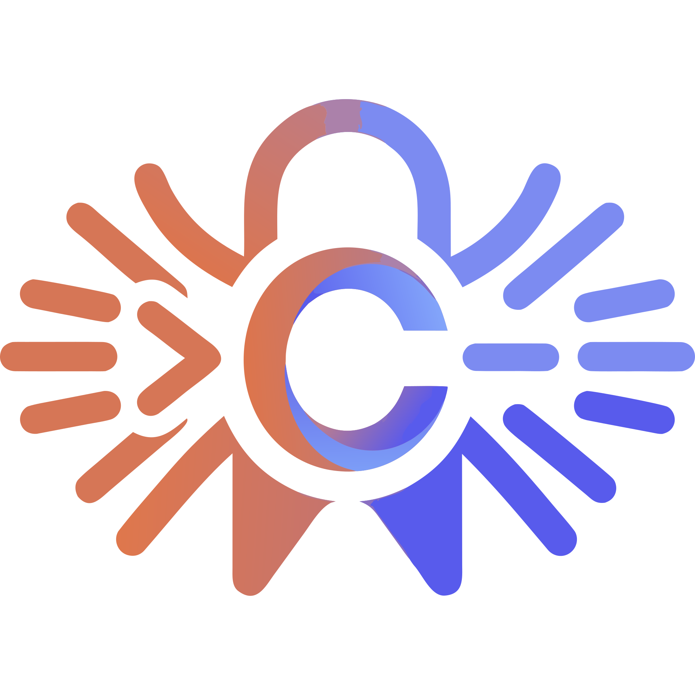

<p align="center"></p>

<h1 align="center">Claudex Autocomplete</h1>

<p align="center">
  Inline ghost-text completions for PhpStorm and other JetBrains IDEs, powered by your local Claude Code CLI or Codex CLI.<br>
  It uses your existing Claude or ChatGPT subscription login. No API key needed.
</p>

<p align="center">
  <a href="https://github.com/krzysztofsurdy/claudex-autocomplete-plugin/actions/workflows/ci.yml"></a>
  <a href="LICENSE"></a>
  
  
</p>

## Features

- Inline gray-text suggestions after a short pause in typing, in any language the IDE edits.
- Two providers: Claude Code (`claude`) and Codex (`codex`), switchable from settings or the status bar.
- Accept a whole suggestion, the next word, or the rest of the line.
- Context-aware: current file (whole or a window around the caret), open tabs, and for PHP the outlines of imported classes, parent class, interfaces and traits.
- Persistent CLI process for lower latency (Claude Code).
- Animated braille spinner with elapsed time at the end of the line while a suggestion is generated.
- Status bar widget with request state, last latency and 5h / 7d usage windows.
- Custom prompt additions, for example "Follow PSR-12".

## Requirements

- JetBrains IDE build 253 or newer (2025.3+).
- One of:
  - Claude Code CLI (`claude`), logged in with your Claude subscription.
  - Codex CLI (`codex`), logged in with your ChatGPT subscription.

## Installation

Install from [JetBrains Marketplace](https://plugins.jetbrains.com/plugin/34817-claudex-autocomplete):

1. In the IDE: Settings | Plugins | Marketplace.
2. Search for "Claudex Autocomplete" and click Install.

Or install a local build from disk: run `./gradlew buildPlugin` (see [Building from source](#building-from-source)), then Settings | Plugins | gear icon | Install Plugin from Disk... and select `build/distributions/claudex-autocomplete-0.1.0.zip`.

## Quick start

1. Log in to a CLI in a terminal:
   - Claude: run `claude`, then `/login`.
   - Codex: `npm i -g @openai/codex` (or `brew install codex`), then `codex login`.
2. Enable completions. They are off until you consent: choose Enable in the first-run notification (the other choices are Settings and Not now; after Not now the prompt is not shown again, enable later from Settings, the status bar menu or Tools | Toggle Claudex Autocomplete), or tick "Enable completions" in Settings | Tools | Claudex Autocomplete. Nothing is sent to Anthropic or OpenAI before that.
3. In Settings | Tools | Claudex Autocomplete pick the Provider and click Test Connection.
4. Start typing in an editor.

## Keyboard shortcuts

| Action | Shortcut |
|---|---|
| Accept whole suggestion | Tab |
| Accept next word | Alt+Right (macOS), Ctrl+Right (Windows/Linux) |
| Accept rest of line | Cmd+Right (macOS), End (Windows/Linux) |
| Dismiss | Esc |
| Trigger a completion manually | Shift+Alt+\ (Shift+Option+\ on macOS) |

Word and line accept reuse your keymap's Next Word and Line End shortcuts. Tools | Toggle Claudex Autocomplete (or a click on the status bar widget) enables or disables the plugin.

Tools | Trigger Claudex Autocomplete forces a completion even in the middle of a line. It has no default shortcut; assign one in Settings | Keymap if you want it.

## Settings

Settings | Tools | Claudex Autocomplete. The most useful options:

| Setting | Default | Notes |
|---|---|---|
| Enable completions | off | Set by the first-run notification or this checkbox |
| Provider | Claude Code | Claude Code or Codex |
| Claude Code CLI path / Codex CLI path | empty | Empty = auto-detect common install locations |
| Model (Claude) | haiku | haiku, sonnet, opus, fable or a full model id |
| Model (Codex) | gpt-5.3-codex | Any model supported by your ChatGPT plan |
| Effort / Reasoning effort | low | Lower is faster |
| Debounce (ms) | 250 | Delay after typing before a request |
| Request timeout (ms) | 8000 | |
| Current file context | auto | Whole file up to 1000 lines, otherwise 150 lines around the caret |
| Include open tabs | true | Character budget configurable |
| Excluded file patterns | `.env`, `*.pem`, `id_rsa*`, ... | Comma-separated file name patterns; matching files, VCS-ignored files and files excluded from the project are never sent as context |
| Include imported classes | true | PHP only, signatures only |
| Multi-line mode | auto | auto / always / never |
| Keep CLI process alive | true | Claude Code only; Codex starts a process per request |
| Custom prompt additions | empty | Appended to the system prompt |
| Disabled languages | empty | Comma-separated language ids |

"Test Connection" runs one completion with the values currently in the form, without saving them.

## How it works

After you pause typing, the plugin sends the CLI the code before and after the caret, a window or the whole of the current file, optionally snippets of other open tabs and (for PHP) outlines of imported classes. With Claude Code the CLI runs as a persistent process, so there is no startup cost per request; Codex runs once per request. The result is shown as ghost text.

Completions are requested only when the text right of the caret on the line is empty or only closing characters, and never in read-only editors or files over 1,000,000 characters. `ANTHROPIC_API_KEY`, `ANTHROPIC_AUTH_TOKEN` and `CLAUDE_CODE_*` environment variables are removed from the CLI environment so your subscription login is always used.

Your code context is sent to Anthropic or OpenAI through the respective CLI, subject to your account's terms.

## Status bar

The widget shows `Claudex: Disabled` until completions are enabled; click it and choose Enable Completions. Afterwards it shows the provider and state, for example `Claude: Ready`, `Waiting…`, `Thinking… Ns`, the last latency, `Error` or `Limit reached`. Only the usage window closest to its limit is shown, for example `Claude: Ready · 5h 41%` (` high` is appended from 80%, for example `5h 92% high`); the tooltip lists both windows with reset times, plus the model. Click it for Enable/Disable, Provider, Open settings and Refresh Usage.

No CLI process is started at IDE startup. Usage is refreshed after completions, via Refresh Usage, or Test Connection. When a usage limit is hit, requests pause until the reset time.

## Troubleshooting

- **Not logged in**: run `claude` then `/login`, or `codex login`, in a terminal.
- **CLI not found**: set the full path in settings. GUI-launched IDEs have a minimal PATH.
- **Slow completions**: use `haiku`, keep "Keep CLI process alive" on, effort `low`, thinking off, and reduce the open tabs budget or file context window.
- **No suggestions**: check that completions are enabled, the status bar widget, the disabled languages list, and that the caret is at the end of the code on its line.
- **Limit reached**: completions resume automatically after the reset time shown in the widget tooltip.

## Building from source

Requires JDK 21. Without extra setup Gradle downloads PhpStorm 2025.3 as the build target. To use a local PhpStorm 2025.3+ install instead (offline, faster), set `localIdePath`; its bundled JetBrains Runtime works as the JDK.

```
export JAVA_HOME=/path/to/PhpStorm.app/Contents/jbr/Contents/Home
./gradlew test         # unit tests and headless IDE platform tests
./gradlew buildPlugin  # zip in build/distributions/
./gradlew runIde       # sandbox IDE
```

Optionally point the build at your local IDE with `./gradlew buildPlugin -PlocalIdePath=/path/to/PhpStorm.app` (or set `localIdePath` in `~/.gradle/gradle.properties`).

## Disclaimer

Claudex Autocomplete is an independent project and is not affiliated with, endorsed or sponsored by Anthropic or OpenAI. Claude is a trademark of Anthropic; Codex is a trademark of OpenAI.

## License

Licensed under the GNU General Public License v3.0. See [LICENSE](LICENSE).

## Contributing

See [CONTRIBUTING.md](CONTRIBUTING.md) for bug reports, setup, tests and commit conventions.
